# Image Retrieval
Truy vấn ảnh dùng các hàm toán học cơ bản. Đây là một project được thực hiện dưới sự hướng dẫn của AI Vietnam

## 1. Giới thiệu

Truy vấn hình ảnh (Images Retrieval) là một bài toán thuộc lĩnh vực Truy vấn thông tin (Information
Retrieval). Trong đó, nhiệm vụ của ta là xây dựng một chương trình trả về các hình ảnh (Images) có
liên quan đến hình ảnh truy vấn đầu vào(Query) và các hình ảnh được lấy từ một bộ dữ liệu hình ảnh
cho trước, hiện nay có một số ứng dụng truy vấn ảnh như: Google Search Image, chức năng tìm kiếm
sản phẩm bằng hình ảnh trên Shopee, Lazada, Tiki,...

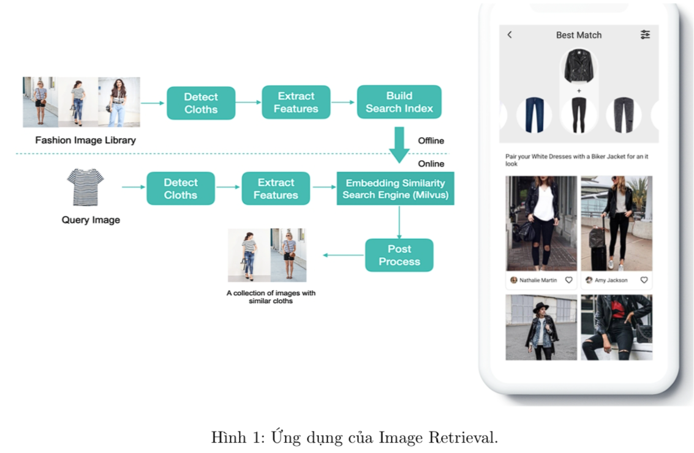

### 1.1. Yêu cầu của bài toán
Xây dựng một chương trình mà khi đưa vào chương trình đó một hình ảnh, nó sẽ hiển thị nhiều hình
ảnh tương tự. Có rất nhiều cách thiết kế hệ thống truy vấn hình ảnh khác nhau, tuy nhiên về mặt tổng
quát sẽ có pipeline như sau:

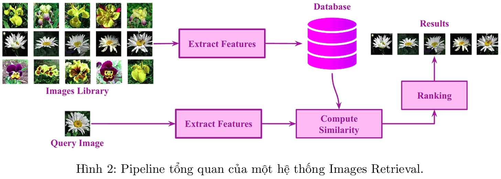

Dựa vào hình trên, có thể phát biểu Input/Output của một hệ thống truy vấn văn bản bao gồm:
- Input: Hình ảnh truy vấn Query Image và bộ dữ liệu Images Library.
- Output: Danh sách các hình ảnh có sự tương tự đến hình ảnh truy vấn.

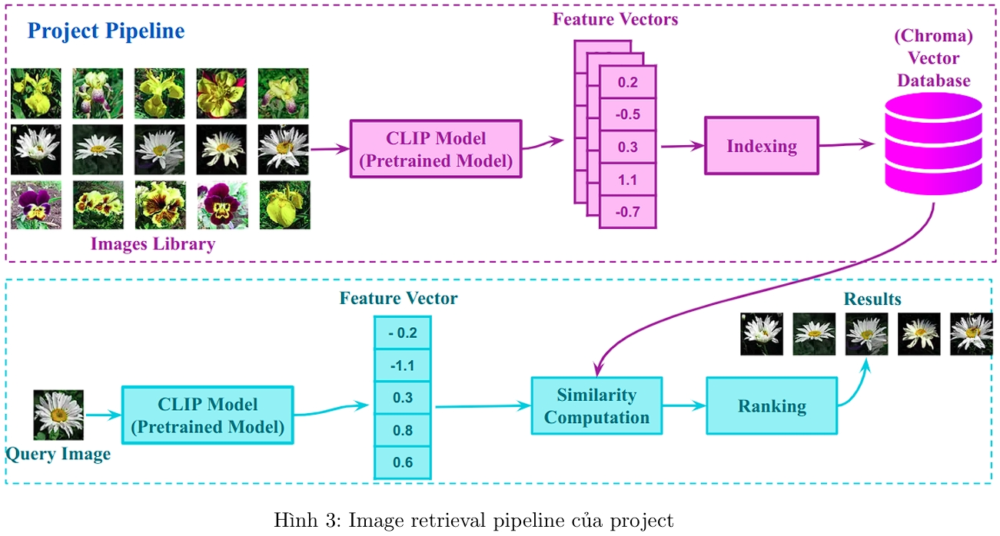

Trong dự án này, chúng ta sẽ xây dựng một hệ thống truy xuất hình ảnh bằng cách sử dụng mô hình
deep learning đã được huấn luyện trước (CLIP) để trích xuất đặc trưng của ảnh và thu được các vector
đặc trưng. Sau đó, chúng ta sẽ sử dụng vector database để index, lưu trữ và truy xuất các ảnh tương
tự với ảnh yêu cầu thông qua các thuật toán đo độ tương đồng.

## 2. Xây dựng chương trình
Dự án này sẽ giới thiệu các phương pháp từ cơ bản đến nâng cao để xây dựng một hệ thống truy vấn
ảnh. Chúng ta sẽ phát triển hệ thống này trên một tập dữ liệu cụ thể. Tiếp theo, dự án sẽ tiến hành
thu thập và xử lý dữ liệu để tạo ra hệ thống truy vấn ảnh được cá nhân hóa cho từng người dùng (phần
đọc thêm (optional)). Các mục tiêu chính của dự án bao gồm:
- Xây dựng chương trình truy vấn ảnh cơ bản.
- Phát triển chương trình truy vấn ảnh nâng cao với CLIP model và vector database.
- (Optional) Thu thập và xử lý dữ liệu nhằm mục đích xây dựng chương trình truy vấn ảnh cá nhân
hóa.

### 2.1 Chương Trình Truy Vấn Ảnh Cơ Bản:
Mục này tập trung vào việc thiết kế và triển khai một hệ thống truy vấn ảnh đơn giản, giúp người dùng
có thể tìm kiếm và truy xuất hình ảnh tương tự. Để có thể tìm được các hình ảnh có liên quan đến
hình ảnh truy vấn, ta có thể sử dụng các chỉ số (metric) được trình bày ở các mục tiếp theo để đo sự tương đồng
giữa hai ảnh.

Các bạn sẽ được cung cấp một tập [data](https://drive.usercontent.google.com/download?id=1msLVo0g0LFmL9-qZ73vq9YEVZwbzOePF) trong đó đường dẫn data/train là nơi chứa đata sẽ trả về kết
quả truy vấn, còn data/test là nơi chứa ảnh sẽ được đem đi truy vấn
Đầu tiên chúng ta sẽ import một số thư viện cần thiết. Để đọc ảnh chúng ta sử dụng thư viện PIL, để
xử lí ma trận chúng ta dử dụng numpy, để thao tác với thư mục, file chúng ta sử dụng thư viện os, sử
dụng matplotlib để hiển thị kết quả. 

```
import os
import numpy as np
from PIL import Image
import matplotlib.pyplot as plt
```

Tiếp theo chúng ta sẽ lấy danh sách các class của ảnh trong data mà ta có

```
ROOT = 'data'
CLASS_NAME = sorted(list(os.listdir(f'{ROOT}/train')))
```

Sau đó để thực hiện tính toán trên các hình ảnh, chúng ta sẽ đọc ảnh, resize về kích thước chung (thì
mới áp dụng được các phép đo) và chuyển đổi nó về dạng numpy:

```
def read_image_from_path(path, size):
    im = Image.open(path).convert('RGB').resize(size)
    return np.array(im)

def folder_to_images(folder, size):
    list_dir = [folder + '/' + name for name in os.listdir(folder)]
    images_np = np.zeros(shape=(len(list_dir), *size, 3))
    images_path = []
    for i, path in enumerate(list_dir):
        images_np[i] =read_image_from_path(path, size)
        images_path.append(path)
    images_path = np.array(images_path)
    
    return images_np, images_path
```

#### 2.1.1. Truy vấn hình ảnh với độ đo L1
Chúng ta xây dựng một hàm absolute_difference() tính độ tương đồng giữa các hình ảnh. Trong ví
dụ này chúng ta sẽ sử dụng hàm L1. Hàm L1 có công thức tính như sau:
$$
L1(\vec{a}, \vec{b}) = \sum_{i=1}^{N} |a_i - b_i|
$$

```
def absolute_difference(query, data):
    axis_batch_size = tuple(range(1,len(data.shape)))
    return np.sum(np.abs(data - query), axis=axis_batch_size)
```

Đến đây chúng ta sẽ thực hiện tính toán để tính độ tương đồng giữa ảnh input và các hình ảnh trong
bộ dữ liệu. Chúng ta sẽ tạo hàm get_l1_score(), hàm này sẽ trả về ảnh query và ls_path_score chứa
danh sách hình ảnh và giá trị độ tương đồng với từng ảnh.

```
def get_l1_score(root_img_path, query_path, size):
    query = read_image_from_path(query_path, size)
    ls_path_score = []
    for folder in os.listdir(root_img_path):
        if folder in CLASS_NAME:
            path = root_img_path + folder
            images_np, images_path = folder_to_images(path, size) # mảng numpy nhiều ảnh, paths
            rates = absolute_difference(query, images_np)
            ls_path_score.extend(list(zip(images_path, rates)))
    return query, ls_path_score
```

Đoạn code này thực hiện quá trình truy xuất hình ảnh bằng cách so sánh một hình ảnh truy vấn với
các hình ảnh trong tập huấn luyện dựa trên điểm L1. Đầu tiên, các hình ảnh được thay đổi cùng kích
thước. Tiếp theo hệ thống sẽ so sánh ảnh truy vấn với các hình ảnh trong thư mục huấn luyện để tính
điểm L1. Sau đó, kết quả truy vấn được trả về là danh sách các đường dẫn chứa hình ảnh và điểm số
tính theo L1. Cuối cùng 5 kết quả tốt nhất sẽ được hiển thị cùng với ảnh truy vấn.

```
def plot_results(querquery_pathy, ls_path_score, reverse):
    fig = plt.figure(figsize=(15, 9))
    fig.add_subplot(2, 3, 1)
    plt.imshow(read_image_from_path(querquery_pathy, size=(448,448)))
    plt.title(f"Query Image: {querquery_pathy.split('/')[2]}", fontsize=16)
    plt.axis("off")
    for i, path in enumerate(sorted(ls_path_score, key=lambda x : x[1], reverse=reverse)[:5], 2):
        fig.add_subplot(2, 3, i)
        plt.imshow(read_image_from_path(path[0], size=(448,448)))
        plt.title(f"Top {i-1}: {path[0].split('/')[2]}", fontsize=16)
        plt.axis("off")
    plt.show()

root_img_path = f"{ROOT}/train/"
query_path = f"{ROOT}/test/Orange_easy/0_100.jpg"
size = (448, 448)
query, ls_path_score = get_l1_score(root_img_path, query_path, size)
plot_results(query_path, ls_path_score, reverse=False)
```

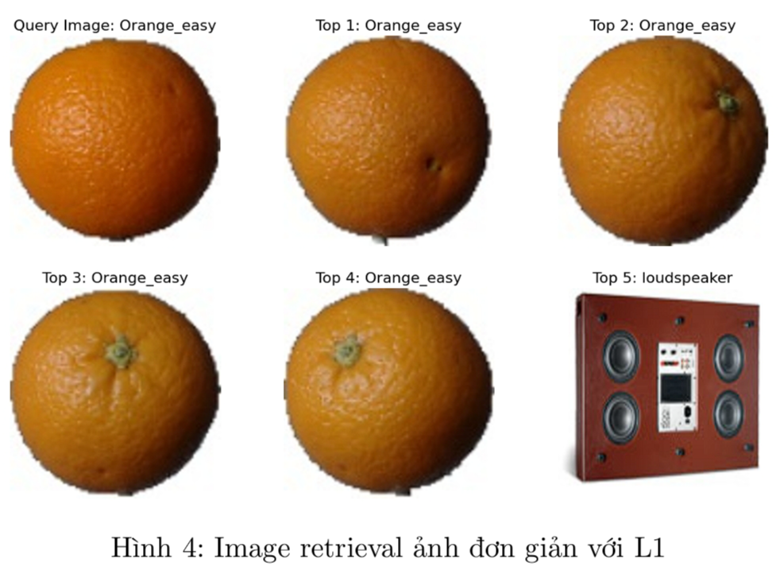

```
root_img_path = f"{ROOT}/train/"
query_path = f"{ROOT}/test/African_crocodile/n01697457_18534.JPEG"
size = (448, 448)
query, ls_path_score = get_l1_score(root_img_path, query_path, size)
plot_results(query_path, ls_path_score, reverse=False)
```

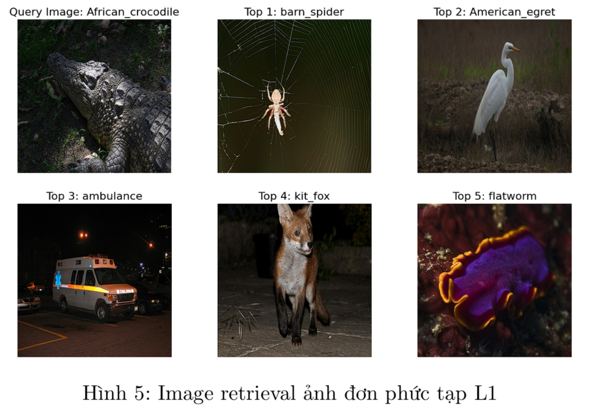

Tiếp theo chúng ta sẽ truy vấn hình ảnh với 3 độ đo L2, Cosine Similarity, Correlation Coefficient.
Chúng ta sẽ thực hiện code tương tự như độ đo L1.

#### 2.1.2. Truy vấn hình ảnh với độ đo L2
$$
L2(\vec{a}, \vec{b}) = \sqrt{\sum_{i=1}^{N} (a_i - b_i)^2}
$$
Chúng ta tạo hàm tính độ tương đồng L2 mean_square_difference()

```
def mean_square_difference(query, data):
    axis_batch_size = tuple(range(1,len(data.shape)))
    return np.mean((data - query)**2, axis=axis_batch_size)
```

Ở đây, chúng ta dùng MSE thay cho L2 vì tính toán tốn ít tài nguyên hơn (căn bậc) và
vì nó cũng tỉ lệ với L2 nên kết quả sẽ không thay đổi.

$$
L2(\vec{a}, \vec{b}) = \sqrt{N \times MSE} = \sqrt{\sum_{i=1}^{N} (a_i - b_i)^2}
$$

Chúng ta tạo hàm get_l2_score(), hàm này tương tự hàm get_l1_score(), chỉ cần thay đổi tại biến
rates.

```
def get_l2_score(root_img_path, query_path, size):
    query = read_image_from_path(query_path, size)
    ls_path_score = []
    for folder in os.listdir(root_img_path):
        if folder in CLASS_NAME:
            path = root_img_path + folder
            images_np, images_path = folder_to_images(path, size) # mảng numpy nhiều ảnh, paths
            rates = mean_square_difference(query, images_np)
            ls_path_score.extend(list(zip(images_path, rates)))
    return query, ls_path_score
```

Để hiển thị kết quả chúng ta sử dụng hàm plot_results() như phép đo L1.

```
root_img_path = f"{ROOT}/train/"
query_path = f"{ROOT}/test/Orange_easy/0_100.jpg"
size = (448, 448)
query, ls_path_score = get_l2_score(root_img_path, query_path, size)
plot_results(query_path, ls_path_score, reverse=False)
```

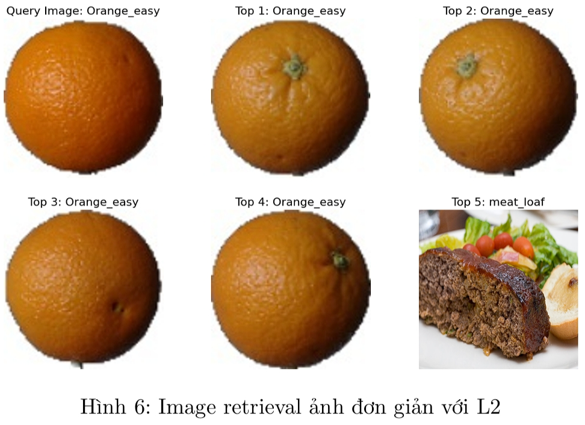

```
root_img_path = f"{ROOT}/train/"
query_path = f"{ROOT}/test/African_crocodile/n01697457_18534.JPEG"
size = (448, 448)
query, ls_path_score = get_l2_score(root_img_path, query_path, size)
plot_results(query_path, ls_path_score, reverse=False)
```

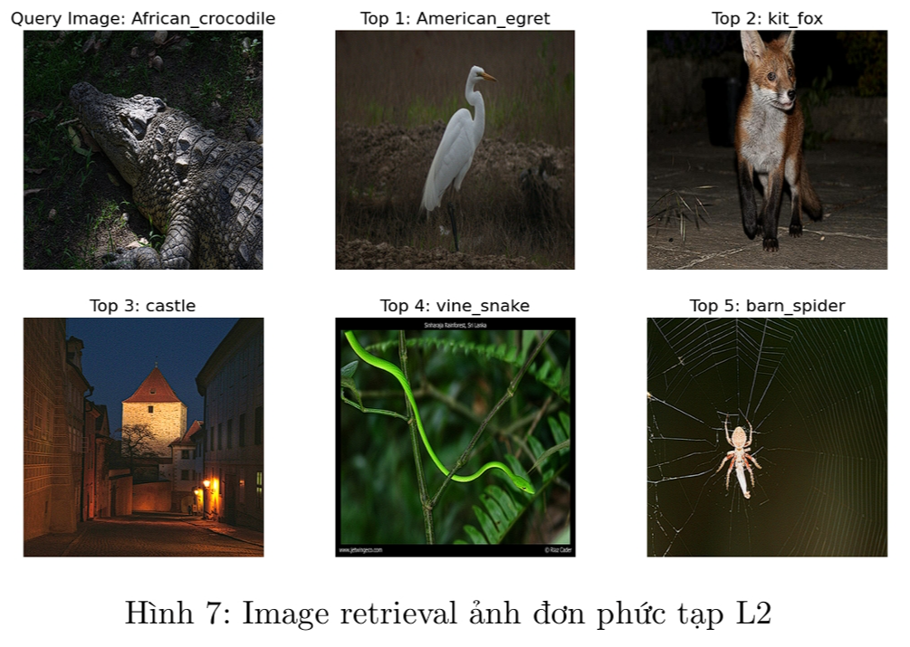

#### 2.1.3. Truy vấn hình ảnh với độ đo Cosine Similarity
$$
\text{cosine\_similarity}(\vec{a}, \vec{b}) = \frac{\vec{a} \cdot \vec{b}}{\|\vec{a}\| \|\vec{b}\|} = \frac{\sum_{i=1}^{N} a_i b_i}{\sqrt{\sum_{i=1}^{N} a_i^2} \sqrt{\sum_{i=1}^{N} b_i^2}}
$$
Chúng ta tạo hàm tính độ tương đồng cosine_similarity().

```
def cosine_similarity(query, data):
    axis_batch_size = tuple(range(1, len(data.shape)))
    query_norm = np.sqrt(np.sum(query ** 2))
    data_norm = np.sqrt(np.sum(data ** 2, axis=axis_batch_size))
    return np.sum (data * query, axis=axis_batch_size) / (query_norm*data_norm + np.finfo(float).eps)
```

Chúng ta tạo hàm get_cosine_similarity_score(), hàm này tương tự hàm get_l1_score().

```
def get_cosine_similarity_score(root_img_path, query_path, size):
    query = read_image_from_path(query_path, size)
    ls_path_score = []
    for folder in os.listdir(root_img_path):
        if folder in CLASS_NAME:
            path = root_img_path + folder
            images_np, images_path = folder_to_images(path, size) # mảng numpy nhiều ảnh, paths
            rates = cosine_similarity(query, images_np)
            ls_path_score. extend(list(zip(images_path, rates)))
    return query, ls_path_score
```

Để hiển thị kết quả chúng ta sử dụng hàm plot_results(), tuy nhiên ở hàm này chúng ta sẽ sắp xếp giá
trị giảm dần từ lớn đến nhỏ vì với độ đo này thì giá trị càng lớn sẽ càng giống nhau, cho nên chúng ta
sử dụng reverse = True.

```
root_img_path = f"{ROOT}/train/"
query_path = f"{ROOT}/test/Orange_easy/0_100.jpg"
size = (448, 448)
query, ls_path_score = get_cosine_similarity_score(root_img_path, query_path, size)
plot_results(query_path, ls_path_score, reverse=True)
```

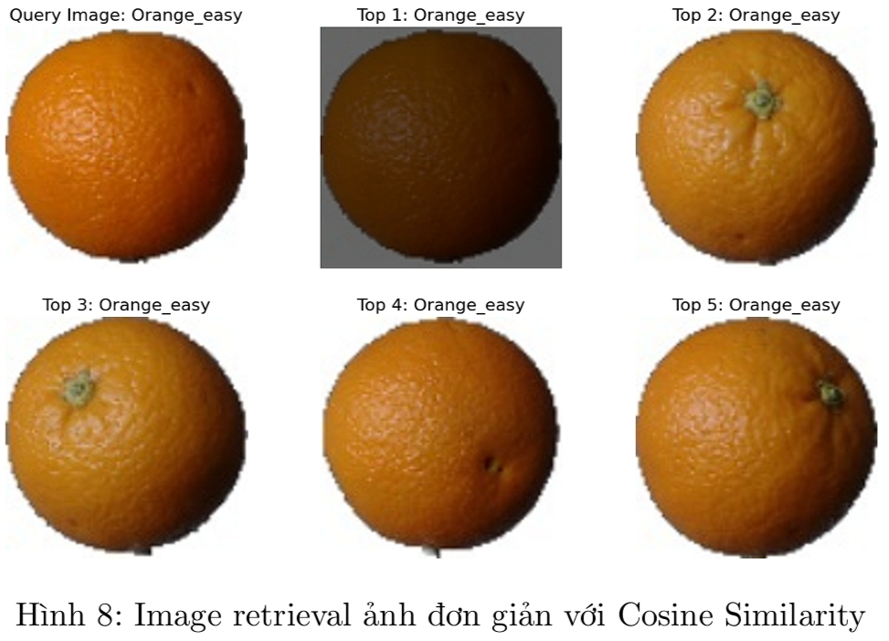

```
root_img_path =f"{ROOT}/train/"
query_path = f"{ROOT}/test/African_crocodile/n01697457_18534.JPEG"
size = (448, 448)
query, ls_path_score = get_cosine_similarity_score(root_img_path, query_path, size)
plot_results(query_path, ls_path_score, reverse=True)
```

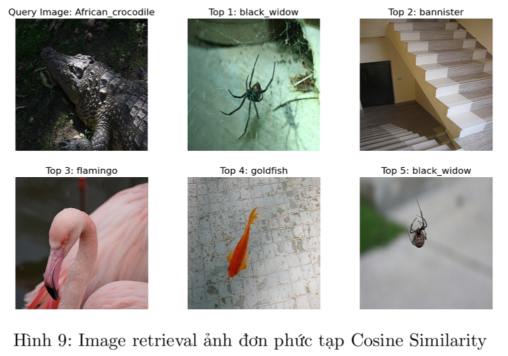

#### 2.1.4. Truy vấn hình ảnh với chỉ số Correlation Coefficient
$$
r = \frac{E[(X - \mu_X)(Y - \mu_Y)]}{\sigma_X \sigma_Y} = \frac{\sum (x_i - \mu_X)(y_i - \mu_Y)}{\sqrt{\sum (x_i - \mu_X)^2} \sqrt{\sum (y_i - \mu_Y)^2}}
$$
Chúng ta tạo hàm tính độ tương đồng correlation_coefficient().

```
import numpy as np

def correlation_coefficient(query, data):
    axis_batch_size = tuple(range(1, len(data.shape)))
    query_mean = query - np.mean(query)
    data_mean = data - np.mean(data, axis=axis_batch_size, keepdims=True)
    query_norm = np.sqrt(np.sum(query_mean**2))
    data_norm = np.sqrt(np.sum(data_mean**2, axis=axis_batch_size))
    return np.sum(data_mean * query_mean, axis=axis_batch_size) / (query_norm * data_norm + np.finfo(float).eps)
```

Chúng ta tạo hàm get_correlation_coefficient_score(),hàm này tương tự hàm get_l1_score().

```
def get_correlation_coefficient_score(root_img_path, query_path, size):
    query = read_image_from_path(query_path, size)
    ls_path_score = []
    
    for folder in os.listdir(root_img_path):
        if folder in CLASS_NAME:
            path = root_img_path + folder
            images_np, images_path = folder_to_images(path, size)  # mảng numpy nhiều ảnh, paths
            rates = correlation_coefficient(query, images_np)
            ls_path_score.extend(list(zip(images_path, rates)))
    
    return query, ls_path_score
```

Để hiển thị kết quả, chúng ta sử dụng hàm plot_results(). Tuy nhiên, trong hàm này, chúng ta sẽ sắp xếp giá trị giảm dần từ lớn đến nhỏ vì với độ đo này, giá trị càng lớn sẽ càng giống nhau, do đó chúng ta sử dụng reverse=True.

```
root_img_path = f"{ROOT}/train/"
query_path = f"{ROOT}/test/Orange_easy/0_100.jpg"
size = (448,448)
query, ls_path_score = get_correlation_coefficient_score(root_img_path, query_path, size)
plot_results(query_path, ls_path_score, reverse=True)
```

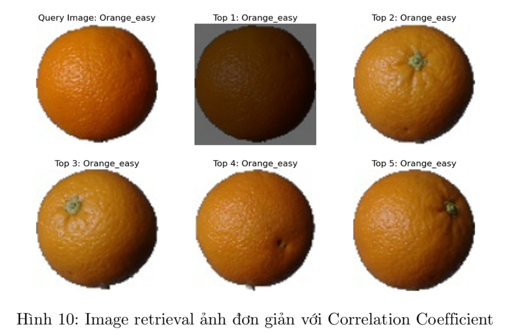

```
root_img_path = f"{ROOT}/train/"
query_path = f"{ROOT}/test/African_crocodile/n01697457_18534.JPEG"
size = (448,448)
query, ls_path_score = get_correlation_coefficient_score(root_img_path, query_path, size)
plot_results(query_path, ls_path_score, reverse=True)
```

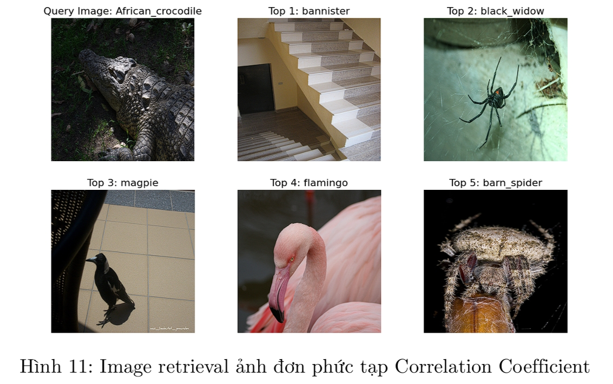

### 2.2. Nâng Cao Chương Trình Truy Vấn Ảnh
Phần này nhằm phát triển các tính năng nâng cao cho hệ thống truy vấn ảnh, bằng cách sử dụng deep
learning model trích xuất feature vector cho các ảnh để tăng cường khả năng truy xuất hình ảnh chính
xác hơn.

Image retrieval sử dụng pretrained deep learning model là một quá trình mà trong đó, các mô hình học
sâu đã được đào tạo trước được sử dụng để tìm kiếm và lấy ra các hình ảnh liên quan từ một tập dữ
liệu lớn dựa trên nội dung hình ảnh. Các mô hình này thường được huấn luyện trên các tập dữ liệu
khổng lồ với hàng triệu hình ảnh để học các đặc điểm quan trọng từ ảnh, cho phép chúng hiểu và biểu
diễn nội dung ảnh một cách hiệu quả.

Trong quá trình tìm kiếm ảnh, một hình ảnh truy vấn được đưa vào mô hình, mô hình sẽ tính toán đặc
trưng của hình ảnh truy vấn và so sánh chúng với các đặc trưng đã được tính toán trước của những
hình ảnh được lưu trữ trên hệ thống. Sự tương đồng giữa các đặc trưng này được sử dụng để xác định
các hình ảnh có liên quan nhất, và kết quả là những hình ảnh tương tự nhất với hình ảnh truy vấn được
trả về cho người dùng. Những mô hình này có khả năng phân tích và nhận diện các đặc tính phức tạp
của ảnh như kết cấu, hình dạng, và màu sắc, do đó chúng rất hiệu quả trong việc tìm kiếm và lấy lại
hình ảnh dựa trên nội dung.

#### 2.2.1. Truy vấn hình ảnh với pretrained deep learning model
Để bắt đầu quá trình truy vấn hình ảnh sử dụng pretrained deep learning model, trước tiên, chúng ta
cần cài đặt hai thư viện quan trọng là chromadb và open-clip-torch. Thư viện chromadb hỗ trợ việc
quản lý và truy xuất dữ liệu hình ảnh hiệu quả (chúng ta cũng sử dụng thêm với mục đích tạo vector
database), và chromadb có thể dùng open-clip-torch để cung cấp khả năng sử dụng mô hình CLIP đã
được đào tạo sẵn, đây là một công cụ mạnh mẽ để phân tích nội dung hình ảnh thông qua học sâu.

```
pip install chromadb
pip install open-clip-torch
```

Import các thư viện cần thiết

```
import os
import numpy as np
from PIL import Image
import matplotlib.pyplot as plt
from chromadb.utils.embedding_functions import OpenCLIPEmbeddingFunction
```

Quá trình thực hiện truy vấn hình ảnh sử dụng mô hình CLIP trong bối cảnh này tương tự như các
bước ở phần cơ bản trước, nhưng chúng ta sẽ nâng cấp bằng cách thêm một hàm để trích xuất vector
đặc trưng cho mỗi hình ảnh. Mô hình CLIP sẽ được sử dụng để biến đổi hình ảnh thành các vector đặc
trưng đại diện cho nội dung và ngữ cảnh của hình ảnh đó. Sau đó, việc so sánh các hình ảnh không
được thực hiện trực tiếp trên ảnh gốc mà là thông qua việc tính sự tương đồng giữa các vector này.
Đoạn code bên đưới khởi tạo một hàm để trích xuất vector đặc trưng từ một hình sử dụng mô hình CLIP.
Tiếp theo, hàm get_single_image_embedding nhận một hình ảnh làm đầu vào và sử dụng phương thức
_encode_image của OpenCLIPEmbeddingFunction để trích xuất ảnh thành một vector đặc trưng.

```
embedding_function = OpenCLIPEmbeddingFunction()

def get_single_image_embedding(image):
    embedding = embedding_function._encode_image(image=image)
    return np.array(embedding)
```

Truy vấn embedding vector với chỉ số L1 hàm get_l1_score được nâng cấp lên bằng cách sử dụng
CLIP model để trích xuất vector đặc trưng.

```
def get_l1_score(root_img_path, query_path, size):
    query = read_image_from_path(query_path, size)
    query_embedding = get_single_image_embedding(query)
    ls_path_score = []
    for folder in os.listdir(root_img_path):
        if folder in CLASS_NAME:
            path = root_img_path + folder
            images_np, images_path = folder_to_images(path, size) # mang numpy nhieu anh, paths
            embedding_list = []
            for idx_img in range(images_np.shape[0]):
                embedding = get_single_image_embedding(images_np[idx_img].astype(np.uint8))
                embedding_list.append(embedding)
            rates = absolute_difference(query_embedding, np.stack(embedding_list))
            ls_path_score.extend(list(zip(images_path, rates)))
    return query, ls_path_score
```

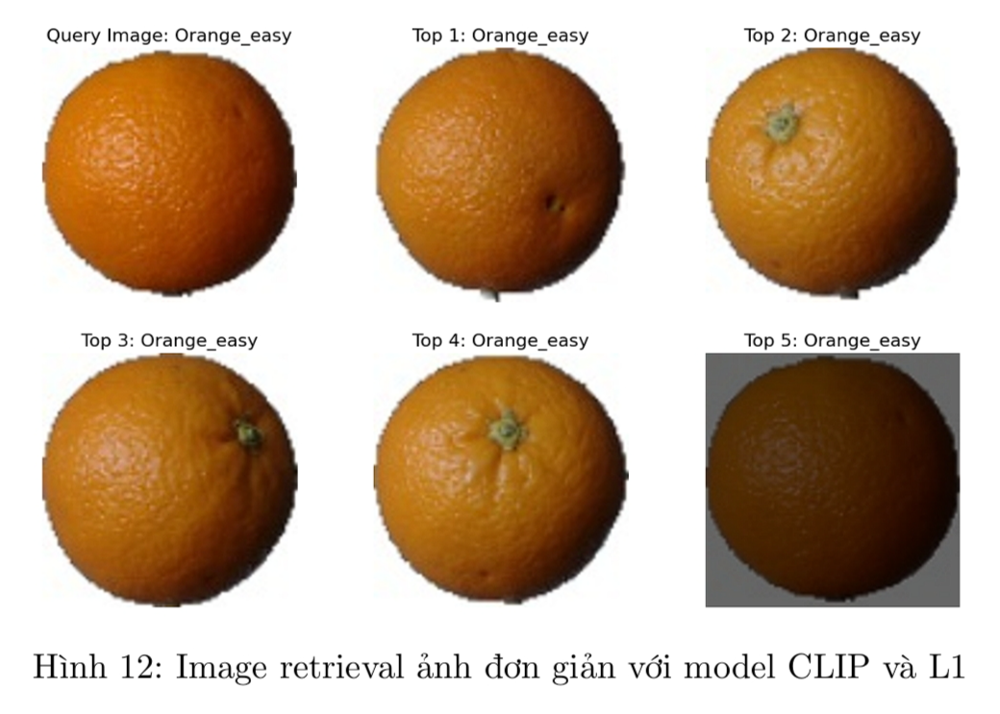

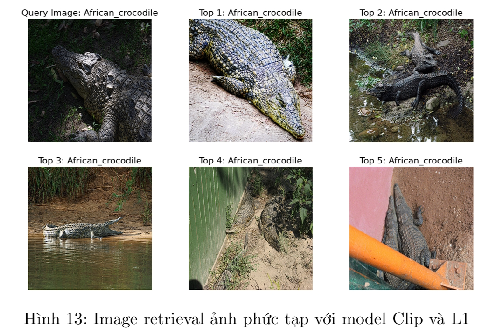

Ba metric còn lại cũng kết hợp với CLIP model theo cách tương tự.
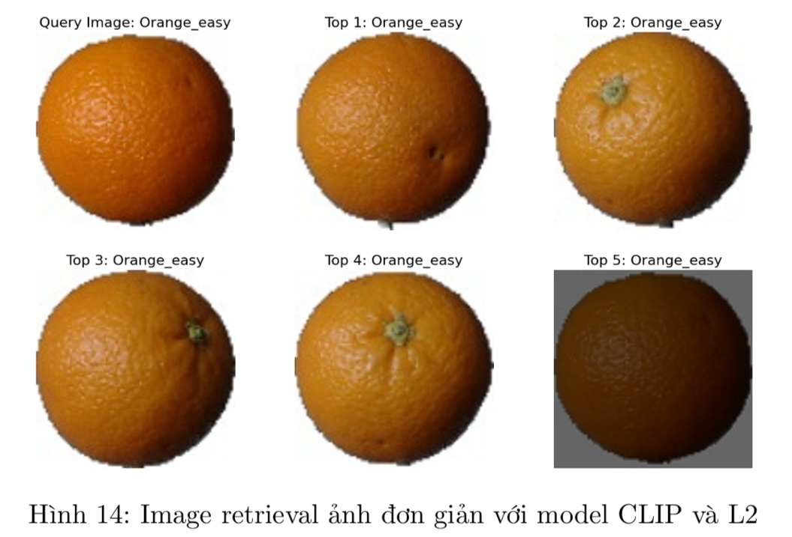
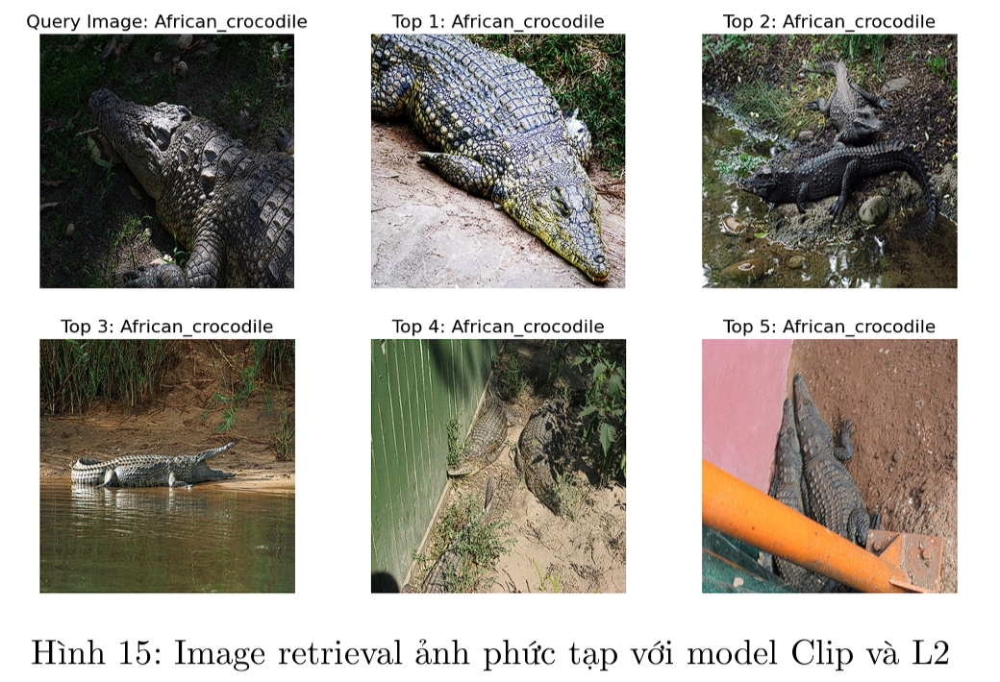
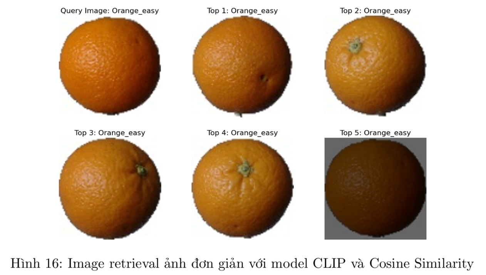
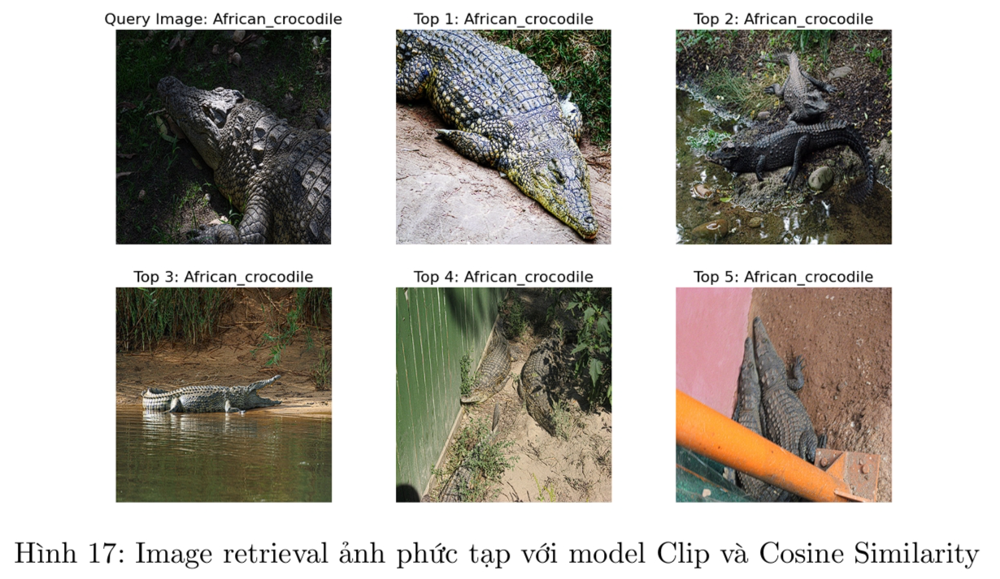
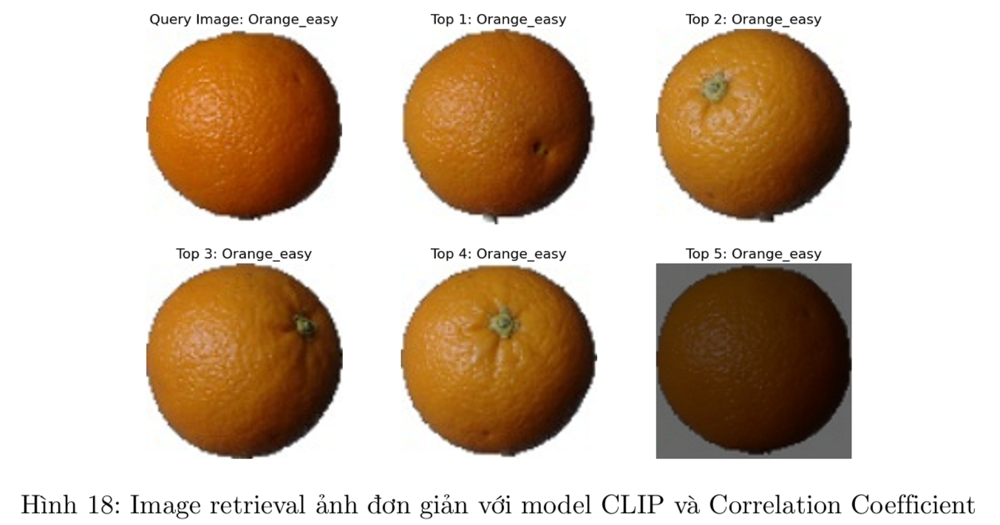
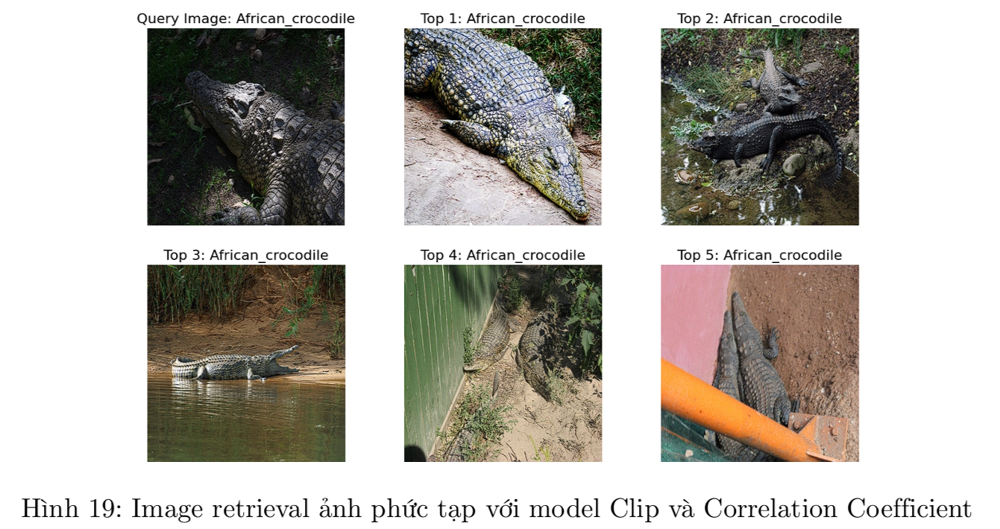

#### 2.2.2. Tối ưu hoá quá trình truy vấn hình ảnh sử dụng mô hình CLIP và cơ sở dữ liệu vector
Chúng ta sẽ tiếp tục phát triển phương pháp ở trên, vì mỗi lần truy vấn đều cần phải sử dụng lại mô
hình CLIP, phương pháp này sẽ sử dụng một cơ sở dữ liệu vector (vector database) để quản lý các
embedding vector, giúp quá trình truy vấn được tối ưu hơn.

Bước đầu tiên là trích xuất vector đặc trưng từ các ảnh và lưu trữ chúng vào cơ sở dữ liệu. Đầu tiên,
ta cần lấy danh sách đường dẫn của các ảnh mà ta muốn trích xuất vector. Đoạn code dưới đây mô tả
quá trình trích xuất đường dẫn của các ảnh từ một thư mục cho trước. Đầu tiên, chúng ta sẽ liệt kê
các thư mục con dựa trên tên của các class (CLASS_NAME). Sau đó, liệt kê tất cả các ảnh trong mỗi
thư mục con và lưu trữ đường dẫn của từng ảnh vào một danh sách.

```
def get_files_path(path):
    files_path = []
    for label in CLASS_NAME:
        label_path = path + "/" + label
        filenames = os.listdir(label_path)
        for filename in filenames:
            filepath = label_path + '/' + filename
            files_path.append(filepath)
    return files_path

data_path = f'{ROOT}/train'
files_path = get_files_path(path=data_path)
```

**Truy vấn ảnh với L2 Collection**

Trong ChromaDB, "collection" là một khái niệm quan trọng, dùng để tổ chức và quản lý dữ liệu. Một collection trong ChromaDB có thể được hiểu như là một tập hợp các vector hoặc tài liệu được chỉ mục và lưu trữ cùng nhau dựa trên một số tiêu chí hoặc đặc điểm chung. Nó tương tự như concept của "table" trong cơ sở dữ liệu quan hệ hoặc "collection" trong MongoDB. Đoạn code sau đây định nghĩa hàm add_embedding, một hàm giúp trích xuất và lưu trữ các vector đặc trưng của ảnh vào một collection đã được tạo.

```
def add_embedding(collection, files_path):
    ids = []
    embeddings = []
    for id_filepath, filepath in tqdm(enumerate(files_path)):
        ids.append(f'id_{id_filepath}')
        image = Image.open(filepath)
        embedding = get_single_image_embedding(image=image)
        embeddings.append(embedding)
    collection.add(
        embeddings=embeddings,
        ids=ids
    )
```

Tiếp theo, chúng ta khởi tạo một client cho cơ sở dữ liệu Chroma và tạo một collection mới với cấu hình sử dụng L2 để so sánh các vector đặc trưng. Sau đó, gọi hàm add_embedding để thêm các vector đặc trưng của ảnh vào collection này, qua đó tạo điều kiện thuận lợi cho việc truy vấn nhanh chóng và hiệu quả.

```
# Create a Chroma Client
chroma_client = chromadb.Client()
# Create a collection
l2_collection = chroma_client.get_or_create_collection(name="l2_collection",
                                                      metadata={HNSW_SPACE: "l2"})
add_embedding(collection=l2_collection, files_path=files_path)
```

HNSW_SPACE là một thuật ngữ liên quan đến thuật toán Hierarchical Navigable Small Worlds (HNSW), được sử dụng để tìm kiếm gần đúng các điểm lân cận nhất (approximate nearest neighbor search) trong không gian vector. Trong trường hợp của đoạn code này "l2" chỉ định rằng khoảng cách Euclidean (L2) sẽ được sử dụng để so sánh các vector.

Hàm search được định nghĩa để thực hiện truy xuất các ảnh dựa trên embedding của ảnh truy vấn. Hàm này nhận đường dẫn của ảnh truy vấn, loại collection và số lượng kết quả trả về mong muốn, sau đó trả về danh sách các kết quả phù hợp.

```
def search(image_path, collection, n_results):
    query_image = Image.open(image_path)
    query_embedding = get_single_image_embedding(query_image)
    results = collection.query(
        query_embeddings=[query_embedding],
        n_results=n_results # how many results to return
    )
    return results
```

```
test_path = f'{ROOT}/test'
test_files_path = get_files_path(path=test_path)
test_path = test_files_path[1]
l2_results = search(image_path=test_path, collection=l2_collection, n_results=5)
plot_results(image_path=test_path, files_path=files_path, results=l2_results)
```

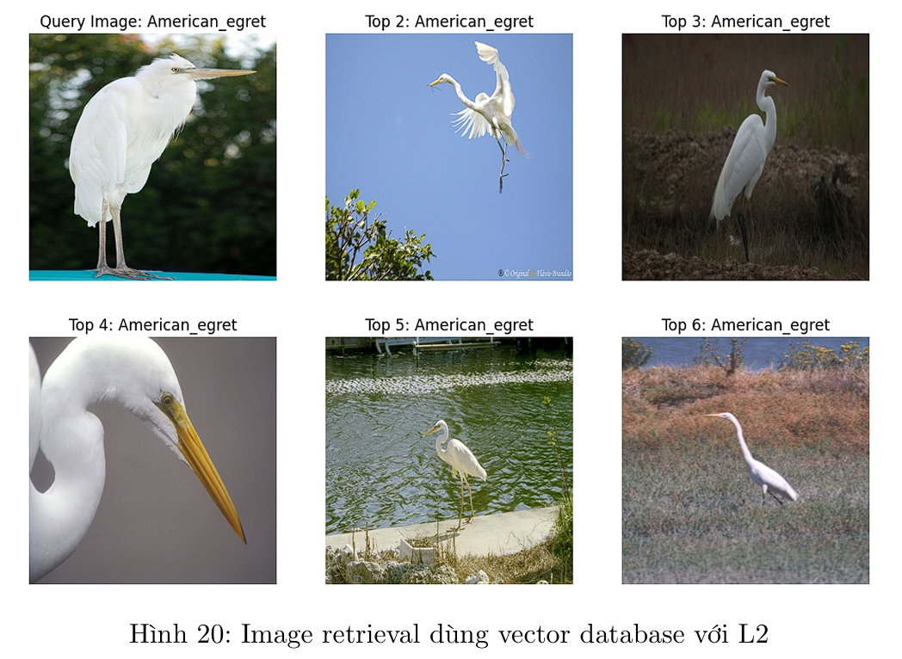

**Truy vấn ảnh với Cosine Similarity Collection**

Tương tự như với L2 collection, đoạn code này khởi tạo một collection mới dựa trên khoảng cách cosine.

```
# Create a collection
cosine_collection = chroma_client.get_or_create_collection(name="Cosine_collection",
                                                           metadata={HNSW_SPACE: "cosine"})
add_embedding(collection=cosine_collection, files_path=files_path)
```

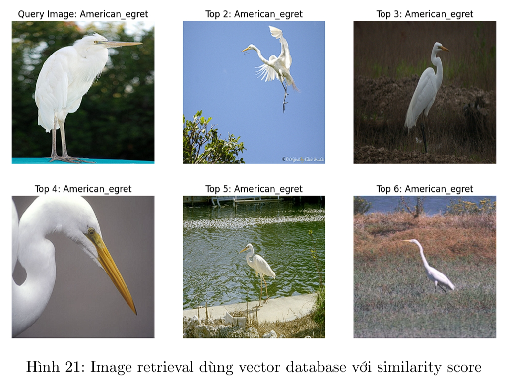
